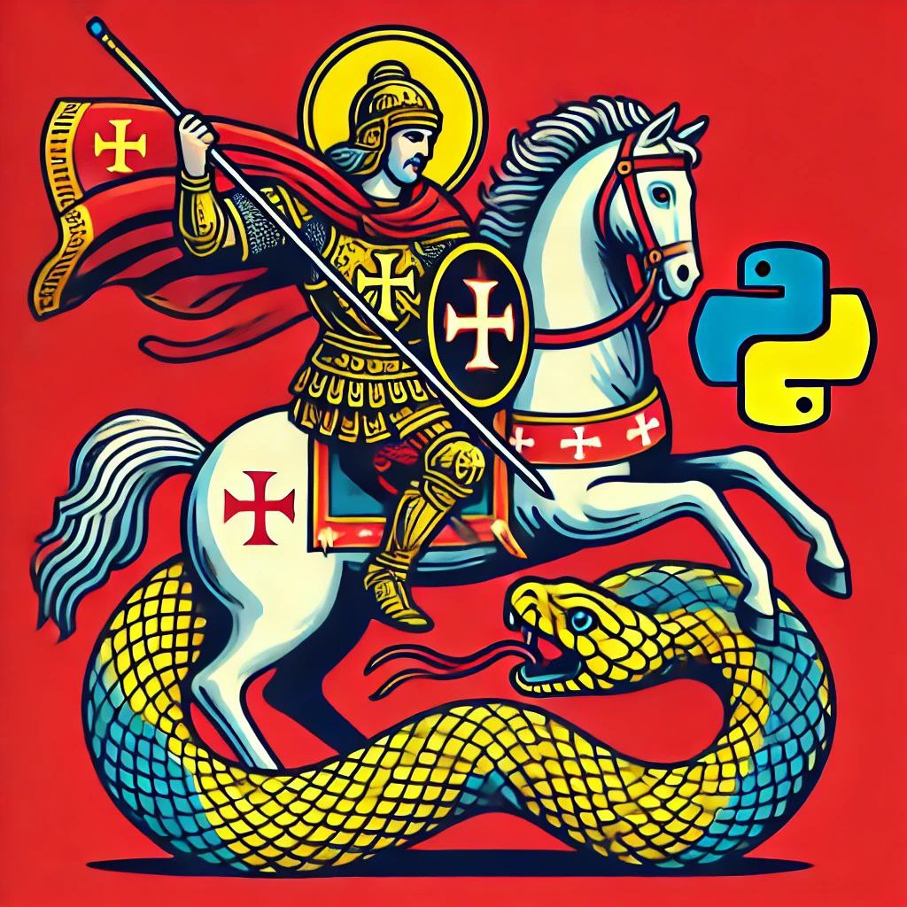

# ZmeyGorynich 🐉 - язык программирования

**Zmey Gorynich** — это интерпретируемый язык программирования с ярко выраженным славянским духом, вдохновленный русским фольклором и культурой. Назван в честь трёхглавого змея из сказаний.

## Особенности языка

- **Славянский синтаксис**: Ключевые слова вроде `молвить` (print), `сотвори` (function), `возверни` (return) и `гойда` (разделитель) придают коду уникальный колорит.
- **Типизация**: Поддержка явной аннотации типов через `быти` (например, `цело` для int, `плывун` для float (и исходные из него `плывун малый точный`, `плывун великий`, `плывун звездный` - аналоги decimal для более точных расчетов), `строченька` для string).
- **Гибкость**: Операции с числами, строками, списками и функциями, включая арифметику (`+`, `-`, `*`, `/`, `**`, `%`), циклы (`покуда`), условия (`аще`, `ино`) и ввод (`внемли`).
- **Массивы**: Простая работа со списками через `созвать_дружину` (создание массива) и доступ по индексу (`массив[1]`).
- **Пляски**: Блоки кода обрамляются фразами `ухожу я в пляс` (начало) и `закончили пляски` (конец), добавляя поэтичности.
- **Гойда**: Конец строки должен обязательно заканчиваться кличем "гойда", аналог ящерского ";".

## Пример кода

```zmeygorynich
молвить("Гой-еси ты Русь родная") гойда

сотвори возвысь(основа, степень) изречет плывун ухожу я в пляс
    возверни основа ** степень
закончили пляски

ящер быти цело = 10 гойда
аще ящер == 10 то ухожу я в пляс
    молвить("Ящер ровно 10!") гойда
закончили пляски

результат = возвысь(2, 3) гойда
молвить(результат) гойда
```
## Вывод:
```text
Гой-еси ты Русь родная
Ящер ровно 10!
8.0
```

# Как работает?
- **Токенизация**: Код разбирается на токены (например, молвить, гойда, числа, строки).
- **AST**: Формируется абстрактное синтаксическое дерево для анализа структуры.
- **Интерпретация**: Выполняется в Python через evaluator.py, поддерживая типы и операции.

# Текущие ограничения
Ограниченная стандартная библиотека — пока только базовые операции.

# История языка

В стародавние времена, когда славяне жили в мире да согласии, напал на их земли злой механический змий, прозванный Python. Был он хитер, быстр и коварен: с железным брюхом, что огнём кодов плевалось, разорял он города русов, сжигая избы да амбары. Много бравых воинов, с мечами да копьями, вышли супротив него, но змий тот был не прост — одним махом проглатывал целые дружины, оставляя лишь дым да искры.

Долго терпели славяне напасти, но вот поднялся из народа рус Георгий Победоносец, парень удалой да смекалистый. Взял он не меч, а ум свой острый, да копьё из крепкого дуба, что сам выточил. Вышел Георгий на бой с Python’ом и, пока змий шипел да программы свои злые крутил, ловко ткнул его в железное сердце. Заскрипел Python, задымился, да и рухнул наземь, загремев шестернями.



Не пропадать же добру, решили славяне. Отдали они тело механического змия лучшим ремесленникам Руси — кузнецам да мастерам хитроумным. Те, недолго думая, разобрали Python’а на части, пригляделись к его нутру железному и молвили: «Эка невидаль! Сделаем-ка мы своего змея, да покраше будет!» И взялись за дело: из проводов да шестерён, из кодов да заклинаний славянских сотворили они нового змея — Змея Горыныча.

Был тот Змей Горыныч не злой, а свой, родной — три головы имел, да каждая по-русски молвила: одна факториалы считала, другая простоту чисел проверяла, а третья тесты весёлые выводила. И пошёл Горыныч по Руси, не города разорять, а людям помогать — то избу построит, то счёт в торгу проверит. Так и повелось: где Python разорял, там Горыныч добро творил.  
